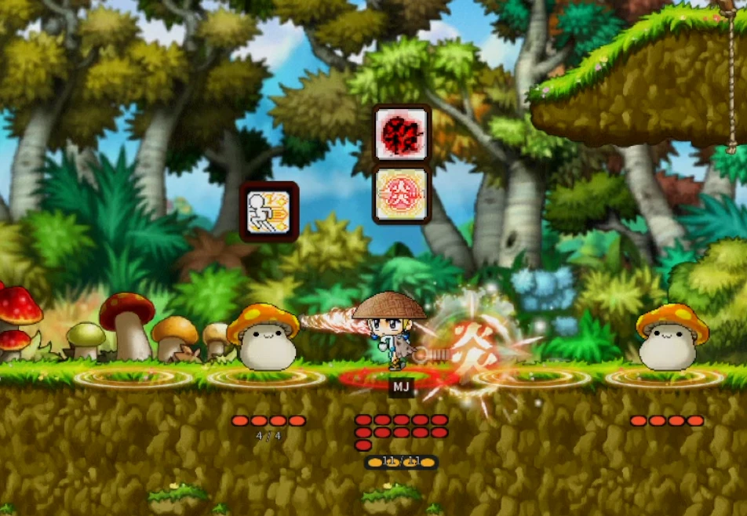
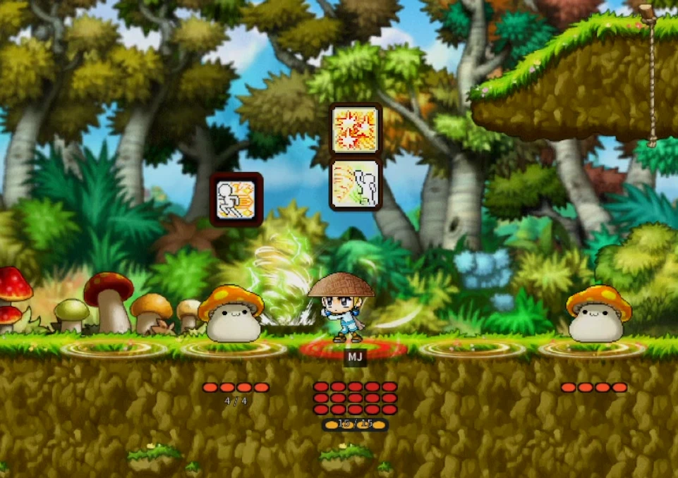
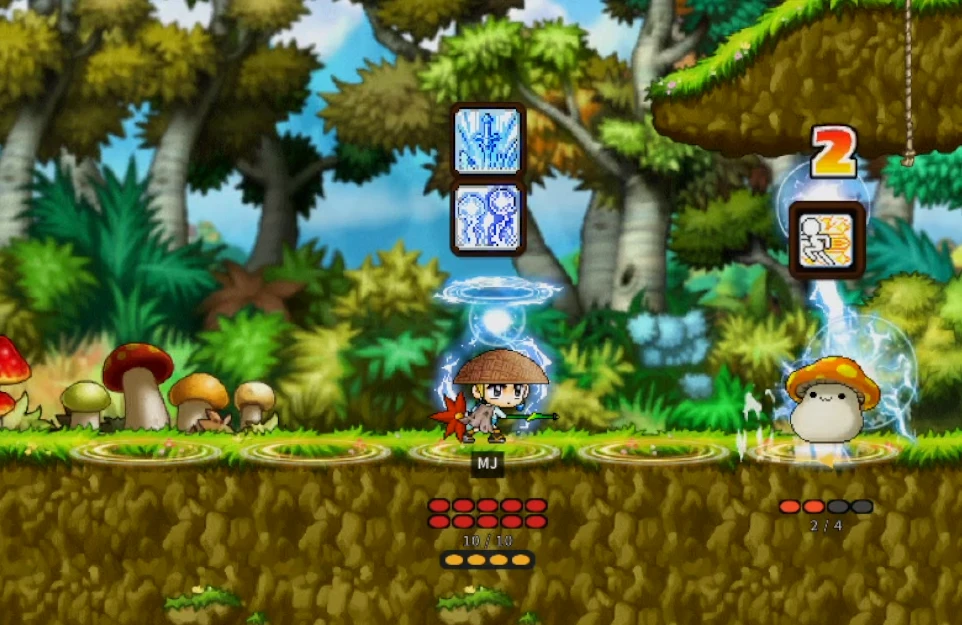
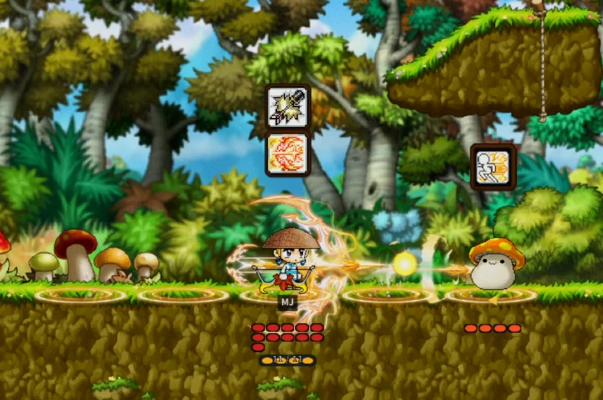

# MapleTactics


> 이 문서는 `v1.0.1` 태그(2026-10-02, `535eeff`) 시점의 저장소를 기준으로 작성되었습니다.


## 📖 프로젝트 소개

**MapleTactics**는 메이플스토리 월드(MapleStory Worlds, MSW)에서 제작한 **1차원 턴제 전술 로그라이크** 게임입니다.

플레이어는 한 줄로 놓인 전장 위에서 **칸 이동과 방향 전환**으로 적이 예고한 공격을 피하고, **스킬을 행동 큐에 조합해 한 번에 순차 실행**하며 전투를 풀어 갑니다. 적이 다음 턴에 무엇을 할지 미리 보여 주기 때문에, 운보다 판단이 승패를 가르는 퍼즐형 전투를 지향합니다.

익숙한 메이플스토리 마을(헤네시스, 커닝시티, 엘리니아, 페리온, 노틸러스, 슬리피우드)을 따라 갈림길 경로를 진행하는 런(Run) 구조 위에, 유물·스킬 증강·상점 같은 로그라이크 성장 요소와 유니온·스킬 트리·도감 같은 영구 성장 요소를 결합했습니다.

**핵심 가치**

- **예측 가능한 전투** — 적 Intent(행동 예고)를 보고 대응하는 결정적(deterministic) 턴제 전투
- **서버 권위 구조** — 전투·보상·저장을 서버가 판정해 클라이언트 조작에 안전한 구조
- **데이터 기반 콘텐츠** — 스킬·적 패턴·스테이지·보상을 CSV(UserDataSet)로 정의해 코드 수정 없이 콘텐츠 확장
- **콘텐츠 무결성 게이트** — 시작 시 전체 데이터를 검증해 잘못된 참조나 값을 행 단위로 보고


## 📸 스크린샷

직업마다 고유한 스킬과 연출로 같은 1차원 전장을 다르게 풀어 갑니다. 머리 위 아이콘은 행동 큐에 등록된 스킬, 적 위 아이콘은 적의 다음 행동 예고(Intent)입니다.

<table>
  <tr>
    <td align="center" width="50%"><br><b>도적</b></td>
    <td align="center" width="50%"><br><b>해적</b></td>
  </tr>
  <tr>
    <td align="center" width="50%"><br><b>마법사</b></td>
    <td align="center" width="50%"><br><b>궁수</b></td>
  </tr>
</table>


## 👥 개발자

| 이름 | GitHub | 주요 기여 영역 (v1.0.1까지의 커밋 기준) |
|---|---|---|
| tyfmq123-hub | <!-- TODO: GitHub 프로필 링크 확인 --> | UI(`.ui`), 코어·전투·로그라이크 스크립트, 데이터 전반 |
| Deok Hwan Kim | [@tiger1710](https://github.com/tiger1710) | 프로젝트 초기화·AI 에이전트 스킬 구성, 로그라이크 흐름, 데이터, UI, 모델 |
| rluan | [@dev-Rluan](https://github.com/dev-Rluan) | 전투 시스템, 데이터·검증, 설계 문서, 몬스터 모델 |
| ohtak6843 | <!-- TODO: GitHub 프로필 링크 확인 --> | 데이터·밸런스, 전투, 설계 문서, 밸런스 도구 |
| LNKatze | <!-- TODO: GitHub 프로필 링크 확인 --> | UI 레이아웃, 맵(`.map`) 제작 |

<!-- TODO: 각 개발자의 공식 역할(기획/클라이언트/아트 등)과 연락처(이메일, 포트폴리오) 추가 -->

> 일부 커밋은 AI 코딩 도구(Claude Code 등)와 공동 작성되었습니다.


## 📅 개발 기간

**2026-07-14 ~ 2026-10-02** (`v1.0.1` 기준, 이후 개발 진행 중)

| 시기 | 마일스톤 |
|---|---|
| 2026-07-14 | 저장소 생성 및 MSW 프로젝트 초기화 |
| 2026-07 하순 | 전투 코어: Effect Router, 스킬 실행 시스템(Effect Executor), 쿨다운 |
| 2026-08 초 | 런 콘텐츠 라우팅, 인벤토리, 런 상점 |
| 2026-08 중순 | 직업별 스킬 카탈로그 분리, 로비 허브·도감·캐릭터 선택 UI, 스킬 강화 단계(Tier) |
| 2026-08 하순 | 월드맵 도시 분기(위쪽/아래쪽 경로)와 지역별 상점 진행 구조 |
| 2026-09 초 | 페리온·엘리니아·노틸러스 지역 및 보스(파우스트, 킹크랑) 추가, 유니온 시스템 통합 |
| 2026-09 중순 | 슬리피우드 지역, 공용 전투 테스트 허브, 스킬 드래그 재배치 |
| 2026-09 하순 | 밸런스 스튜디오, 직업 유물·스킬 증강, 전투 연출 개선 |
| **2026-10-01** | **`v1.0.0` 릴리스** |
| **2026-10-02** | **`v1.0.1` 릴리스** — 이동 차단 연출 및 애니메이션 로딩 UI 개선 |


## 🛠 개발 환경

| 항목 | 내용 |
|---|---|
| OS | Windows <!-- TODO: 팀 개발 OS 버전 확인 --> |
| 엔진 / IDE | MapleStory Worlds Maker |
| MSW CoreVersion | `26.7.0.0` (`Global/WorldConfig.config`) |
| 스크립트 언어 | mLua |
| AI 개발 도구 | Claude Code, Cursor, Codex + MSW AI 스킬 세트 (`@maplestoryworlds/ai-cli`, 버전 고정: `skills-lock.json`) |
| 보조 도구 런타임 | Node.js (밸런스 도구 테스트), Python (회귀 테스트 스크립트) <!-- TODO: Node.js / Python 버전 명시 --> |
| 형상 관리 | Git, GitHub (`main` / `develop` 브랜치 + Pull Request) |


## 🧰 기술 스택

| 분류 | 기술 |
|---|---|
| **게임 엔진** | MapleStory Worlds (MSW) |
| **게임 로직** | mLua — `@Component` / `@Logic` / `@Event`, `@ExecSpace` 기반 서버·클라이언트 분리 |
| **콘텐츠 데이터** | MSW UserDataSet (`.csv` + `.userdataset`, 48개 테이블) |
| **월드 리소스** | `.map` (27개 맵), `.model` (88개 모델), `.ui` (29개 UI 그룹) |
| **영구 저장** | `_DataStorageService` (UserDataStorage / GlobalDataStorage) |
| **밸런스 도구** | HTML / JavaScript 단일 파일 웹 도구 (Balance Studio, Balance Workbench) |
| **테스트** | Node.js 내장 테스트 러너(`node --test`), Python 스크립트, Maker 런타임 검증 |


## ✨ 주요 기능

### 전투

- **1차원 셀 전장** — 전투 유닛은 물리 이동이 아닌 서버 권위의 논리 셀(Cell) 단위로 움직이며, 적이 좌우 어느 쪽에도 나타나 방향 전환이 핵심 조작이 됩니다.
- **행동 큐 시스템** — 스킬을 큐(기본 3칸, 직업·증강·유물로 변동)에 등록한 뒤 한 번에 순차 실행하며, 실행 순간의 보드 상태로 대상을 다시 계산합니다. 큐 항목은 드래그로 재배치할 수 있습니다.
- **적 Intent 예고** — 적은 공격 준비(`ATTACK_READY`) 상태를 미리 드러내고, 예고된 공격은 실행 시점의 위치로 판정되므로 이동·회전으로 회피할 수 있습니다.
- **데이터 기반 적 AI** — 적별 동시 계획을 턴 시작에 고정하는 Pattern Runner와 `HEAVY`·`DOUBLE_STRIKE` 같은 특성(Trait)으로 몬스터 행동을 CSV만으로 정의합니다.
- **보스 페이즈** — HP 임계치에 따른 패턴 교체, 범위 공격 예고, 소환·증원을 지원하는 7종의 보스(머쉬맘, 다일, 파우스트, 스켈레톤 지휘관, 킹크랑, 포장마차, 주니어 발록)가 등장합니다.
- **웨이브와 드롭** — 전멸·턴·시간 조건으로 이어지는 웨이브 증원, 적 처치 드롭과 스테이지 클리어 보상을 중복 지급 없이 처리합니다.

### 직업과 스킬

- **5개 직업** — 전사·마법사·궁수·도적·해적이 각자 고유 HP, 큐 용량, 시작 스킬, 무기, 직업 메커니즘(예: 전사의 전방 밀치기)을 가집니다.
- **직업 스킬 68종 + 유틸 스킬 5종** — 피해·다단히트·버프·회복·밀치기·자기 이동 등 범용 Effect Executor를 조합해 정의하며, 스킬 강화 단계(Tier)를 지원합니다.
- **스킬 증강** — 일반·히든 증강을 스킬당 최대 6단계까지 누적할 수 있고, 3택 선택과 리롤로 빌드를 구성합니다.

### 로그라이크 런

- **6개 지역, 28개 스테이지** — 헤네시스에서 출발해 위쪽(커닝시티 → 페리온) 또는 아래쪽(엘리니아 → 노틸러스) 경로를 고른 뒤 슬리피우드에서 합류하는 노드 그래프 진행 구조입니다.
- **런 상점과 유물** — 지역 사이 경로 상점에서 골드로 유물(50종)과 소모품을 구매하며, 유물 효과는 런 스냅샷을 통해 전투에 적용됩니다.
- **스킬 획득·강화 스테이지** — 새 스킬 선택, 스킬 교체, 스킬 강화 전용 스테이지로 런 중 빌드를 성장시킵니다.
- **런 결과와 기록** — 서버가 확정한 런 결과를 저장하고, 최고 기록과 런 히스토리를 UI로 제공합니다.

### 영구 성장 및 로비

- **유니온 시스템** — 직업별 B~SSS 등급이 유니온 스탯 포인트를 만들고, 플레이어가 이를 자유롭게 배분하며 유니온 코인 상점을 이용합니다.
- **스킬 트리** — 유니온 코인으로 영구 해금 요소를 구매하고, 런 출발 시점의 소유 상태를 고정해 적용합니다.
- **로비 허브** — 그리드 이동 기반 로비에서 직업 선택, 몬스터·스킬·아이템 도감, 설정(키 바인딩 포함)에 접근합니다.
- **쿠폰·프리미엄 혜택** — 서버 검증 기반 쿠폰 코드와 월드샵 패스 혜택을 지원합니다.
- **연출** — 데미지 스킨, 맵별 BGM 플레이리스트, 피격·이동 Hop 연출, 맵 전환 로딩 UI를 제공합니다.

### 품질 및 개발 지원

- **콘텐츠 무결성 검증** — `ContentValidatorLogic`과 도메인별 Validator가 시작 시 전체 CSV의 참조와 값을 검사하고 행 단위로 오류를 보고합니다.
- **전투 테스트 허브** — `battle_test_hub` 맵에서 스테이지·직업·Seed를 골라 실제 운영 진입 경로로 바로 전투를 시작할 수 있습니다.
- **스킬 테스트 맵** — `skill_test` 맵에서 스킬 수치를 조정하고 결과를 로그로 내보내 밸런스 도구에 반영할 수 있습니다.
- **밸런스 도구** — 브라우저에서 데이터 폴더를 열어 스킬·몬스터·스테이지·경제·드롭을 시각적으로 조정하고 게임과 같은 규칙으로 검증합니다.


## 🗂 폴더 구조

```text
MapleTactics/
├── RootDesk/MyDesk/          # 게임 스크립트와 리소스 (작업 공간)
│   ├── 00_Core/              # 로비, 설정, 이동, 오디오, 유니온·스킬 트리·쿠폰 등 메타 시스템
│   ├── 01_Combat/            # 전투 세션, 턴, 유닛, 적 AI, 스킬·효과 실행기, 증강
│   ├── 02_UI/                # HUD·팝업·월드맵·상점 등 UI 컴포넌트와 Presenter
│   ├── 03_Data/              # 콘텐츠 CSV(UserDataSet)와 Repository / Validator
│   ├── 04_Roguelike/         # 런 매니저, 런 콘텐츠 흐름, 상점, 스킬 스테이지
│   ├── 05_Test/              # 전투 테스트 허브, 스킬 테스트 로직
│   └── Models/               # 몬스터·오브젝트·파티클·펫 모델
├── map/                      # 로비, 지역별 전투·보스 맵, 상점, 테스트 맵
├── ui/                       # UI 그룹 정의 (.ui)
├── Global/                   # 엔진 기본값 및 월드 설정 (직접 수정 금지)
├── Docs/                     # GDD, 구현 계획, 데이터 사전, 시스템 가이드(Docs/Guide)
├── tools/                    # Balance Studio / Workbench 및 검증 스크립트
└── Artifacts/tests/          # 회귀 테스트 스크립트와 픽스처
```

> 스크립트는 189개의 `.mlua` 파일로 구성되며, 각 `.mlua`는 Maker가 생성하는 `.codeblock`과 짝을 이룹니다.

### 아키텍처 원칙

- 전투 상태는 맵 범위의 `BattleSessionComponent`가 단독 소유하고, 플레이어별 런 상태는 `PlayerRunStateComponent`가 소유합니다.
- 콘텐츠는 `CSV → Repository → Validator → Resolver/Executor` 경계를 따르며, 전투 세션에 콘텐츠 ID별 분기를 넣지 않습니다.
- UI는 서버가 만든 상태 DTO(`GetBattleUiState()` 등)만 표시하며 가격·피해·보상을 직접 계산하지 않습니다.


## 📚 개발 문서

- [M1 GDD](Docs/MapleTactics-M1-GDD.md)
- [로드맵](Docs/MapleTactics-Roadmap.md)
- [아키텍처 구현 가능성 검토](Docs/MapleTactics-M1-Architecture-Review.md)
- [구현 계획](Docs/MapleTactics-M1-Implementation-Plan.md)
- [데이터 사전](Docs/MapleTactics-M1-Data-Dictionary.md)
- [유니온 2026 설계](Docs/Union2026Design.md)
- [시스템 가이드 모음](Docs/Guide/) — 전투 코어, 웨이브, 보스 페이즈, 증강·직업·데미지 스킨 작성, 콘텐츠 검증, 개발 워크플로 등


## 📝 개발 규칙

- `.codeblock`, `.directory`, `Environment/`, `Global/`(신규 파일 생성)은 직접 수정하지 않습니다.
- `.model`, `.map`, `.ui`는 전용 Builder 또는 Maker를 통해 편집합니다.
- 새 스킬 효과·적 패턴 값을 추가하면 `tools/balance-studio.html`의 `#vocabCatalog`도 함께 갱신합니다.
